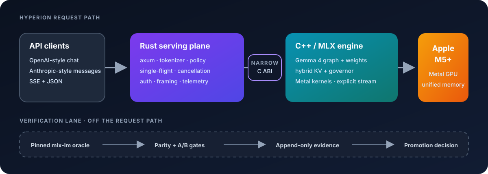

# Hyperion

**M5-first local inference in Rust + MLX. Gemma 4 today; Qwen hybrid next.**

Hyperion is an open-source, clean-sheet inference runtime for people who want modern open-weight
models to feel native on an Apple M5-class Mac. The current implementation targets Gemma 4; the
next architecture family is Qwen's hybrid Gated DeltaNet/attention stack, beginning with the
[Qwen3.8-27B](https://huggingface.co/Qwen/Qwen3.8-27B) text path. Rust owns serving,
scheduling, policy, and tokenization; a C++/MLX engine owns model execution behind a narrow C ABI.
The project favors correct model math, bounded memory, real streaming, and reproducible evidence
over a broad compatibility matrix.

> [!IMPORTANT]
> Hyperion is pre-1.0 and under active development. It requires Apple GPU family 10 (M5
> generation) or newer, macOS 26.2 or newer, and MLX 0.32.0 exactly. M1-M4 Macs and non-Apple
> platforms are intentionally unsupported. Model weights are not included.

## Why Hyperion

- **Model-native:** family-specific graph, state, weight, and conversation behavior behind one
  shared serving and memory-policy core. Gemma 4 is implemented first; Qwen support is active R&D.
- **M5-first:** the runtime targets Metal, unified memory, and the M5 generation directly;
  the platform canary fails loudly on unsupported hosts and there is no slower fallback backend.
- **Local API, native request path:** OpenAI- and Anthropic-compatible HTTP subsets, real SSE,
  an in-process tokenizer, and no Python process in the serving path.
- **Evidence before claims:** correctness outranks throughput, performance changes are
  baseline-gated, and only accepted measurements in the append-only ledger support public claims.

## Architecture



The serving process owns one MLX engine thread and admits one generation at a time. That
deliberate single-flight design keeps stream ownership, cancellation, model state, and memory
admission explicit while the runtime matures. The architecture is being generalized through
family-specific adapters; Gemma and Qwen will share policy and serving surfaces without sharing
incompatible graph, cache, or prompt assumptions.

## Project status

Hyperion separates code completion from milestone acceptance. “Implemented” below does not imply
accepted real-model parity or a performance claim.

| Area | Evidence-backed state |
|---|---|
| Platform and reproducibility | **Accepted M0:** M5/macOS/MLX canary, pinned toolchains, model inventory/conversion checks, and a pinned `mlx-lm` Gemma oracle |
| Native Gemma runtime | **Implemented, acceptance pending:** Gemma 4 12B QAT MLX-affine Q4/g64 graph, cache machinery, narrow C ABI, and model-free/tiny-fixture native tests |
| Serving contracts | **Implemented:** OpenAI-style chat/model discovery and Anthropic-style messages/token counting; real SSE, cancellation, bounded single-flight admission, and non-streaming responses |
| Tool contracts | **Implemented and contract-tested:** bounded declarations/history, `auto`/`none`, incremental Gemma parsing, validation/deduplication, and OpenAI/Anthropic streaming and non-streaming response shapes; real-model quality acceptance remains pending |
| Memory and performance | Fail-closed governor implemented; M1 measurement remains deferred and the latest M3 governor calibration does not pass its acceptance gate. **There is no accepted native performance claim yet.** |
| Qwen | **Research and design only:** no Qwen artifact is currently accepted or loadable through the native Hyperion runtime |

The following are still active work, not shipped capabilities:

- Thinking-lane SSE framing and transcript policy beyond the currently supported text path.
- Real-model acceptance for the Gemma tool path, plus checkpoint-specific Qwen
  thinking/tool rendering and parsing.
- A dual-family adapter boundary and native Qwen3.8 text graph.
- Low-bit Qwen artifact selection, measured 16K memory fit, and any promoted custom Metal weight
  or cache kernels.
- Transactional model reload and complete process-lifetime graceful shutdown.
- Stable installation and release packaging.
- Runtime qualification beyond M5-or-newer Apple GPUs and the exact pinned MLX version.
- Constrained JSON, later speculative decoding, vision, and longer-context tiers.

The tracked [milestone gates](docs/goal-package/10-milestones-and-gates.md) describe the current
Gemma implementation program and evidence rules; they are being reconciled with the dual-family
direction above. See the [risk register](docs/goal-package/11-risk-register.md) and
[accepted ADRs](docs/decisions/) for the current engineering record.

## Direction

The next program keeps Gemma 4 as a first-class family while adding a separate Qwen hybrid
adapter. The initial Qwen target is text-only, batch-one inference with a 16K total-token request
envelope on the 16 GB M5.

- Start with resident scalar low-bit weights and BF16 KV; promote custom compression only when it
  wins measured quality, memory, and latency gates.
- Keep Qwen's recurrent Gated DeltaNet state in FP32 until long-run evidence supports otherwise.
- Use SSDs for bounded conversion, cold components, and explicit prefill experiments—not as an
  implicit swap-backed dense decode engine.
- Bind tokenizers, chat templates, thinking/tool grammar, and generation defaults to exact
  checkpoints rather than assuming one protocol per architecture family.

These are development targets, not claims of current Qwen support.

## Quick start

### Prerequisites

- An Apple M5-generation-or-newer Mac running macOS 26.2+
- Xcode Command Line Tools, CMake 3.25 or newer, and the Metal toolchain
- MLX **0.32.0 exactly**, including its CMake package and `libmlx.dylib`
- Rust 1.95.0; [`rust-toolchain.toml`](rust-toolchain.toml) pins the toolchain and components

Hyperion looks for MLX at `/opt/homebrew/opt/mlx` by default. Set `MLX_ROOT` to a different
installation prefix when needed.

Clone the repository and run the model-free platform canary:

```sh
git clone https://github.com/jscott3201/hyperion.git
cd hyperion
cargo run --locked -p hyperion-bench -- canary
```

This compiles the Rust workspace, native C++/MLX library, and Metal canary, then verifies the
platform and pinned runtime before any model is loaded.

### Prepare the current Gemma 12B developer model

Model preparation additionally requires `uv` 0.11.5 exactly, Python 3.12.13, `jq`, and the
Hugging Face `hf` CLI.
The source checkpoint is about 23.9 GB and the converted artifact is about 6.3 GiB. Plan for
at least 35 GB of free space, and potentially more if another Hugging Face cache retains a
second copy.

```sh
scripts/setup-oracle.sh
scripts/download-m0-model.sh
scripts/convert-m0-model.sh
scripts/hash-m0-model.sh
scripts/verify-m0-models.sh
```

The scripts pin the upstream revision and conversion recipe, then verify the exact source and
converted inventories. Payloads stay under the gitignored `artifacts/models/` tree. This is a
developer workflow for the current implementation, not a stable release installer.

### Start the server

```sh
cargo run --locked --release -p hyperion-server -- \
  --model artifacts/models/gemma4-12b-qat-mlx-g64-b4
```

Hyperion listens on `127.0.0.1:8080` by default. Try a streaming OpenAI-style request:

```sh
curl -N http://127.0.0.1:8080/v1/chat/completions \
  -H 'content-type: application/json' \
  -d '{
    "model": "gemma4-12b-qat-mlx-g64-b4",
    "messages": [{"role": "user", "content": "Explain unified memory in two sentences."}],
    "max_tokens": 96,
    "temperature": 0,
    "stream": true
  }'
```

A non-loopback bind is rejected unless a bearer token is configured:

```sh
cargo run --locked --release -p hyperion-server -- \
  --model artifacts/models/gemma4-12b-qat-mlx-g64-b4 \
  --addr 0.0.0.0:8080 \
  --token "$HYPERION_BEARER_TOKEN"
```

## Development

The fast, model-free pull-request gate is:

```sh
scripts/ci-pr.sh
```

It expects CMake, MLX 0.32.0, `jq`, and `ripgrep`, matching the CI environment. Hosted CI takes
an even shorter policy-only path when a change is limited to documentation. Within CI, the
exact Python oracle is recreated and byte-attested only by the protected release and measurement
gates.

For the native model-free suite alone:

```sh
scripts/test-native.sh --model-free
```

Both commands build native and Rust artifacts. On a space-constrained machine, prefer the
narrowest relevant test target and use `cargo clean` after the artifacts are no longer useful.
Real-model and benchmark gates are intentionally separate from ordinary pull-request CI.

## Repository map

| Path | Purpose |
|---|---|
| [`crates/`](crates/) | Six Rust crates for core policy, model geometry, tokenization, FFI, serving, and benchmarking |
| [`native/hyperion_mlx/`](native/hyperion_mlx/) | C++17 MLX graph, KV/cache machinery, platform policy, and Metal kernels |
| [`docs/goal-package/`](docs/goal-package/INDEX.md) | Goal contract, architecture, milestones, gates, and risk register |
| [`docs/decisions/`](docs/decisions/) | Numbered architectural decision records |
| [`benchmarks/BENCHMARKS.md`](benchmarks/BENCHMARKS.md) | Append-only evidence ledger; only `MEASURED` rows support benchmark claims |
| [`artifacts/models/MANIFEST.md`](artifacts/models/MANIFEST.md) | Pinned model revisions, hashes, conversion identity, sizes, and license reviews |
| [`PROVENANCE.md`](PROVENANCE.md) | First-party lineage and file-specific fixture licensing |

## Contributing

Hyperion is open while the runtime contract is still being hardened. Issues, research
reproductions, and focused pull requests are welcome. Before changing runtime behavior, read the
[accepted ADRs](docs/decisions/), current
[goal package](docs/goal-package/INDEX.md), and repository
[agent/build law](docs/goal-package/AGENTS.md). The goal package still reflects the Gemma-first
implementation sequence and is being revised for the dual-family direction; open an issue before
starting a broad architectural rewrite. Keep changes focused, pair performance work with
correctness evidence, and never weaken a frozen gate to make a result pass.

## License

Unless otherwise noted, Hyperion's project-authored source code and documentation are
available under either the [MIT License](LICENSE-MIT) or the
[Apache License 2.0](LICENSE-APACHE), at your option.

This repository does not bundle or relicense Gemma, Qwen, or other model weights. The four small
real-model-derived oracle fixtures are Apache-2.0-only and documented in
[`PROVENANCE.md`](PROVENANCE.md); model artifacts and third-party dependencies remain governed
by their own terms. Review the pinned model card and preserve applicable license or notice
material before redistribution. Hyperion is not affiliated with or endorsed by Google, Apple,
Qwen, Hugging Face, or the MLX project.
